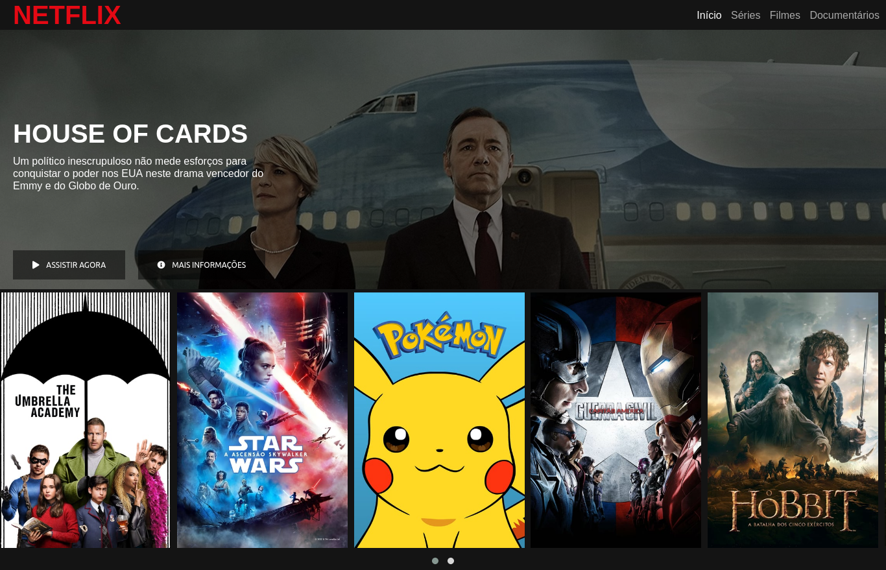
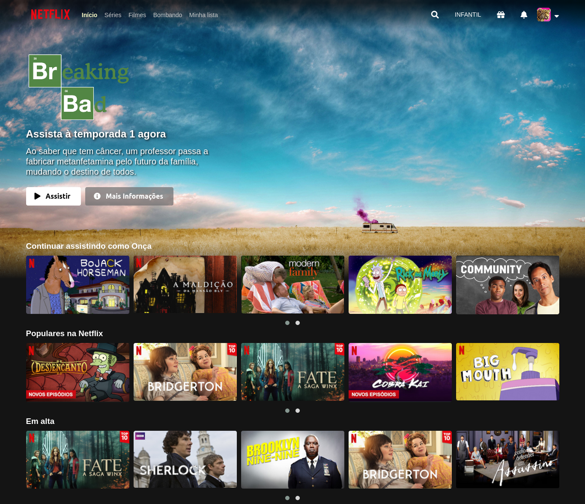

# Recriando a Interface da Netflix (:construction: Em desenvolvimento! :construction:)

Atividade referente ao Bootcamp Avanade Angular Developer produzido pela Digital Innovation One, que propõe uma recriação aproximada da página inicial da Netflix abordando tecnologias como HTML, CSS e JavaScript. Esse projeto é baseado no vídeo tutorial do expert [Felipe Aguiar](https://www.linkedin.com/in/felipe-aguiar-047/), disponibilizado na plataforma da Digital Innovation One e chamado "Recriando a Interface do Netflix".

Você pode conferir a página [aqui](https://lucaxfelis.github.io/netflix-interface/).

## Implementações extras

Além dos componentes desenvolvidos no vídeo tutorial, eu realizei implementações extras a fim de tornar o projeto o mais semelhante possível com a plataforma atual da Netflix:

* Mudança no layout de navegação superior
* Mudança no layout do card principal
* Favicon
* Página inicial para escolha de usuário
* Imagem e nome de usuário dinâmicos
* Mudança no layout dos carrosséis de imagens

## Tecnologias utilizadas
* HTML
* CSS
* JavaScript
* JQuery
* Owl Carousel plugin

## Layout Inicial

## Layout Atual

